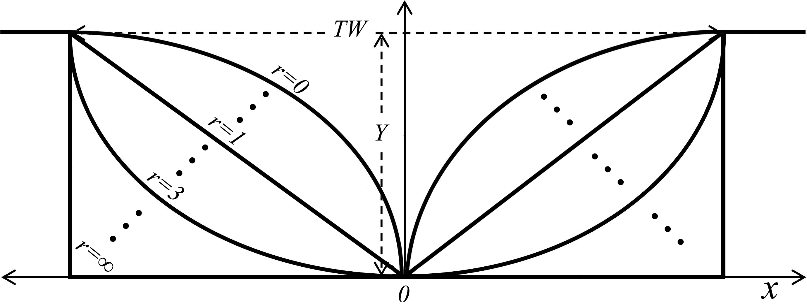
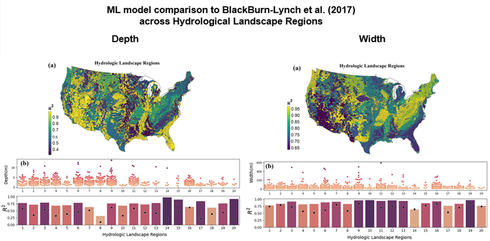
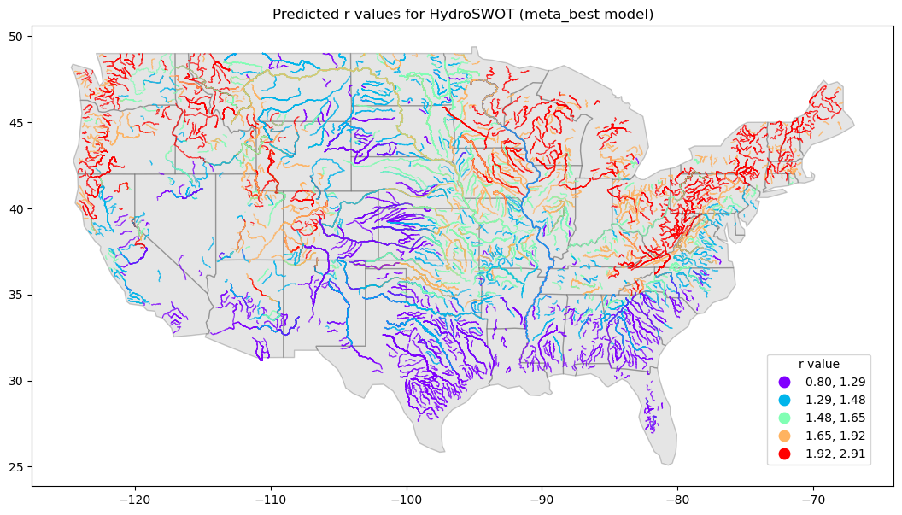

# ML channel geometry


- [Repo](#Repository)
  * [Cloning](#Cloning)
- [Overview](#Overview)
- [Data Model](#Data-Model)
- [Width and Depth](#ML-Width-Depth)
- [Shape](#ML-Channel-Shape)
- [Getting involved](#Getting-involved)
- [Open source licensing info](#Open-source-licensing-info)


## Repository

This repository contains description of the Machine Learning (ML) data models for estimation of bankfull channel width, depth, and shape to be used in the development of the 3D hydrofabrics.

[**Bankfull Width and Depth**](channel-WD/README.md)

[**Bankfull Shape**](channel-shape/README.md)
  
### Cloning

```shell
git clone https://github.com/NOAA-OWP/3d-hydrofabric.git 
```
## Overview

This project is comprised of multiple subparts that together form a clear picture of 3D hydrofabric data model. One of the challenges of this work is mapping river bathymetries where there is no observation/measurement. The missing topobathy data is the in-channel part of a river system that a Digital Elevation Model (DEM) is not able to penetrate and sees the area as a flat surface. This missing topobathy data results in a misrepresentation of river volume. A representation of channel **depth (D), width (W), and shape** will allow better characterization of flow dynamics and help improve hydrodynamic models, routing models, and synthetic rating curves.

**These three characteristics are obtained from satellite imagery, other data products, and machine learning models and describe in channel geometry that substitutes locations where there is no bathymetry measurement. The new channel shapes that has an estimate of missing channel area will improve modeling capabilities compared to having no bathymetry data**

## Data Model

The structure of the data model is based on the reference Hydrofabric Data Model and 

* contains Bankfull (defined as 2-year flood frequency) and in-channel (defined as 2-year flood frequency) width and depth ML estimates
* contains channel shape ML estimates based on analytical derivation of parameter r from [Dingman (2007)](https://www.sciencedirect.com/science/article/pii/S0022169406005063?casa_token=gKpjjfHrupEAAAAA:Cp1tVhLnwlfddS38gpcKiyOm_xR09JeTgEtYZbCP-c8SUSth6Fx6gBPOWeyxZldCClEL20EJ2JI)
* Indexed to the National Hydrologic Geospatial Fabric (hydrofabric) for the Next Generation (NextGen) Hydrologic Modeling Framework

## ML Width Depth

The goal of this machine learning model is to learn channel width, and depth using at a feature hydraulic geometry relations ([see here](https://noaa-owp.github.io/hydrofabric/articles/07-channel-geometry.html)). Here we use the concept of paramterizing channel proposed by [Dingman (2007)](https://www.sciencedirect.com/science/article/pii/S0022169406005063?casa_token=gKpjjfHrupEAAAAA:Cp1tVhLnwlfddS38gpcKiyOm_xR09JeTgEtYZbCP-c8SUSth6Fx6gBPOWeyxZldCClEL20EJ2JI) to get an estimate of channel shape.

The inputs to the model are carefully chosen from investigating a wide litrature on this topic including works by [Lin et al., 2020](https://agupubs.onlinelibrary.wiley.com/doi/full/10.1029/2019GL086405), [Blackburn-Lynch et al., 2017](https://onlinelibrary.wiley.com/doi/full/10.1111/1752-1688.12540?casa_token=UgvAE7gtRPsAAAAA%3Anb2Kq8WP8d_TAD8lu7CE1CkpaY7386FzBPvym436EOqP3gc7pGKRcxE_Tt1XQEtRYEAngTHmLa1iDxo), [Doyle et al., 2023](https://onlinelibrary.wiley.com/doi/full/10.1111/1752-1688.13116?casa_token=mGKCMw89-DoAAAAA%3AF3lJezzo74bXEB-8uo04pBYyth6ny9pi_R_u9Ubb48cI7sMO9erOisD_g8dQsjd-r-LHJEO-e0hT_EA).

These data include:
1. Climate variables
2. Soil and sub-surface characteristics
3. Catchment characteristics
4. Topology and flow characteristics
5. National Water Model flood frequencies
6. Anthropogenic Influences

These data are aggregated from various databases including, the reference fabric, StreamCat, NWM 2.1, different satellite, reanalysis, and LSM models.

The [HYDRoSWOT](https://data.usgs.gov/datacatalog/data/USGS:57435ae5e4b07e28b660af55) – HYDRoacoustic dataset in support of Surface Water Oceanographic Topography is used as ground truth data for our ML models. A rigorous fitting and data cleaning procedure is applied using the [AHGestimation](https://mikejohnson51.github.io/AHGestimation/) package ([Johnson et al, 2023](https://www.preprints.org/manuscript/202212.0390/v1)).  

Given a set of characteristics described above the ML model predicts all 6 coefficients and exponents of the hydraulic geometry relations for bankfull width, depth, and velocity. It also predicts the channel shape parameter (Dinman's r)
that gives a schematic representation of the channel shape.

<div style="display: flex; justify-content: center;">
  
</div>
.

The predictions of Bankfull width and depth surpass the currently implemented regional estimates in NWM 2, 2.1, and 3 for different hydrological landscape regions.




To deploy the ML model 
```shell
cd channel-WD/deployment
bash conda_setup.bash -n -1 
```
Where:  

**-n** is the number of cores to be used in parallel. An integer depends on the number of cores. Use -1 for utilizing all

To train the ML model 

```shell
cd channel-WD
./run_ml.bash -c mymodel -n -1 -x False -y False -r 0.6 -t 5
```
Where:  

**-c** is the name of the running script and generated folder with outputs. Any name.

**-n** is the number of cores to be used in parallel. An integer depends on the number of cores. Use -1 for utilizing all

**-x** is the to apply a transformation to predictor variables. Options are True and False

**-y** is the to apply a transformation to predicted variables. Options are True and False

**-r** is the coefficient of determination used to filter bad measurements in ADCP data. Ranges from 0.0-1.0

**-t** is the count threshold to filter stations that have number of recorded observations greater than the count threshold i.e., 5


## ML Channel Shape

The channel shape ML model is trained similarly to that channel shape and width model. The testing however is done in time varying way such that every measurement of width and depth for a respective discharge are tested against the predicted AHG coefficients by plugin discharge into the learned AHG relations. The trained ML model then can be used to predict channel shape for all valid locations in HydroSWOT database.



And further extended to CONUS based on reference fabric.

For comprehensive details please visit this [site](https://sites.google.com/u.boisestate.edu/conus-fhg/home?pli=1#h.p04mdv3fynoe) for more details.

To train the ML model 

```shell 
cd channel-shape
sh run_ml.bash -c mymodel -n -1 -x False -y False -r 0.8
```

Where:  

**-c** is the name of the running script and generated folder with outputs. Any name.

**-n** is the number of cores to be used in parallel. An integer depends on the number of cores. Use -1 for utilizing all

**-x** is the to apply a transformation to predictor variables. Options are True and False

**-y** is the to apply a transformation to predicted variables. Options are True and False

**-r** is the coefficient of determination used to filter bad measurements in ADCP data. Ranges from 0.0-1.0

## Getting involved

NOAA's National Water Center welcomes anyone to contribute to the 3D Hydrofabric repository to enhance OWP's FIM and NextGen capabilities. Please contact Arash Modaresi Rad (arash.rad@noaa.gov) or Fernando Salas (fernando.salas@noaa.gov) to get started.

----

## Open source licensing info
1. [TERMS](TERMS.md)
2. [LICENSE](LICENSE)


----

## Credit and References


----

