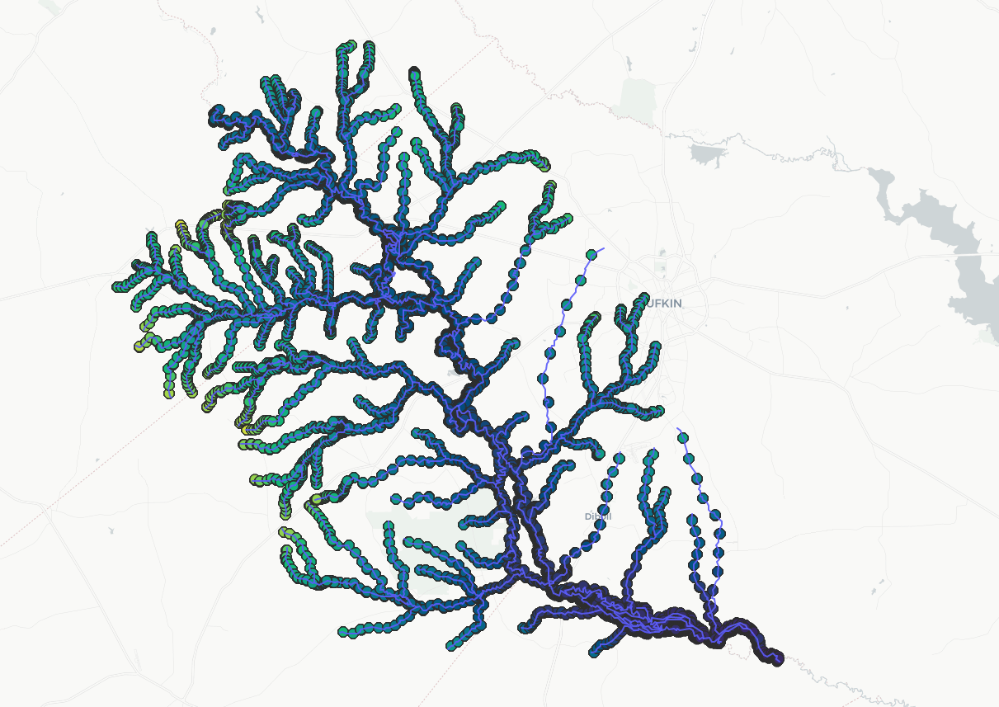
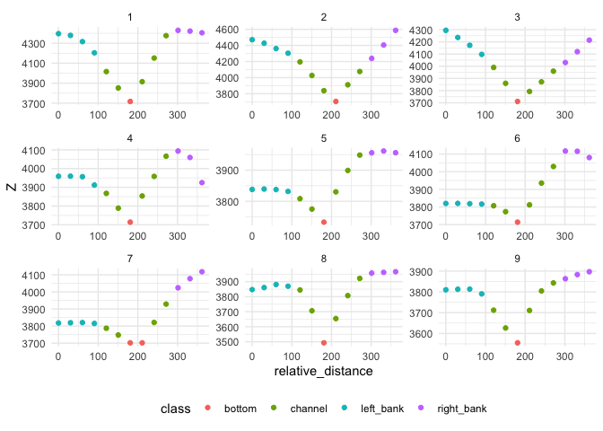

# 3D channel geometry

- [Repo](#Repository)
  * [Cloning](#Cloning)
- [Overview](#Overview)
- [Cross Sections](#Cross-section-cutting-tool)
- [Missing in Channel shape](#ML-channel-shape-model)
  * [Input data](#Input-data)
  * [Outputs](#Outputs)
  * [Results](#Results)
- [Missing in Channel WD](#ML-channel-WD-model)
  * [Input data](#Input-data)
  * [Outputs](#Outputs)
  * [Results](#Results)
- [Channel Roughness](#ML-channel-roughness)
  * [Input data](#Input-data)
  * [Outputs](#Outputs)
  * [Results](#Results)
- [Remote sensing](#RS-and-other-products) 
- [HEC_RAS/LIDAR](#HEC_RAS/LIDAR)
- [Costal test site](#Costal-test-site)


## Repository

This repository contains all data models, software, technical details of the development of a 3D channel geometry for CONUS.
  
### Cloning

```shell
git clone https://github.com/NOAA-OWP/3d-hydrofabric.git 
```
## Overview

This project is comprised of multiple subparts that together form a clear picture of 3D hydrofabric data model. One of the big challenges of this work is mapping river bathymetries where there is no observation/measurement. The missing topobathy data is the in-channel part of a river system that a Digital Elevation Model (DEM) is not able to penetrate and sees the area as a flat surface. This missing topobathy data results in a misrepresentation of river volume. A representation of channel **depth (D), width (W), shape, and roughness(n)** will allow better characterization of flow dynamics and help improve hydrodynamic models, routing models, and synthetic rating curves.

**These four characteristics are obtained from ML models and describe in channel geometry that substitutes locations where there is no bathymetric measurement. The new channel shapes will improve modeling compared to having no bathymetric data**

For larger river systems, we use different remote sensing and post-process products such as [Global River Widths from Landsat (GRWL)](https://zenodo.org/record/1297434), [MERIT Hydro](http://hydro.iis.u-tokyo.ac.jp/~yamadai/MERIT_Hydro/), etc. 

Finally, all these data are provided through a software package that cuts cross-sections along rivers. For floodplains, the package currently uses 10m DEM that extracts all elevation points required to form a cross-section.

The cross-section tool purpose is to generate DEM-based cross-sections (flood plains) for hydrographic networks and contains the ML estimates of bankfull channel cross sections and wherever there is HEC-RAS or Lidar data it incorporates them as well. 

An example of how these cross-sections look is shown below and a full description is available at [terrain_sliceR](https://github.com/mikejohnson51/terrain_sliceR)




Some of the key features of this package are:

1. Speed of the cross-section cutting tool ...
2. ...

More details about the proposed data model that follows Hyfeatures referencing and how tabular and spatial data are represented can be found [here](https://noaa-owp.github.io/hydrofabric/articles/cs_dm.html)


## ML channel shape model

The goal of this machine learning model is to learn channel shape using at a feature hydraulic geometry relations. Here we use the concept of paramterizing channel shape proposed by [Dingman (2007)](https://www.sciencedirect.com/science/article/pii/S0022169406005063?casa_token=gKpjjfHrupEAAAAA:Cp1tVhLnwlfddS38gpcKiyOm_xR09JeTgEtYZbCP-c8SUSth6Fx6gBPOWeyxZldCClEL20EJ2JI) to get an estimate of channel shape.

### Input data

The inputs to the model are carefully chosen from investigating a wide litrature on this topic including works by [Lin et al., 2020](https://agupubs.onlinelibrary.wiley.com/doi/full/10.1029/2019GL086405), [Blackburn-Lynch et al., 2017](https://onlinelibrary.wiley.com/doi/full/10.1111/1752-1688.12540?casa_token=UgvAE7gtRPsAAAAA%3Anb2Kq8WP8d_TAD8lu7CE1CkpaY7386FzBPvym436EOqP3gc7pGKRcxE_Tt1XQEtRYEAngTHmLa1iDxo), [Doyle et al., 2023](https://onlinelibrary.wiley.com/doi/full/10.1111/1752-1688.13116?casa_token=mGKCMw89-DoAAAAA%3AF3lJezzo74bXEB-8uo04pBYyth6ny9pi_R_u9Ubb48cI7sMO9erOisD_g8dQsjd-r-LHJEO-e0hT_EA).

These data include:
1. Climate variables
2. Soil and sub-surface characteristics
3. Catchment characteristics
4. Topology and flow characteristics
5. National Water Model flood frequencies
6. Anthropogenic Influences

These data are aggregated from various databases including, the reference fabric, StreamCat, NWM 2.1, different satellite, reanalysis, and LSM models.

### Outputs

Given a set of characteristics described above the ML model predicts all 6 coefficients and exponents of the hydraulic geometry relations for bankfull width, depth, and velocity. It also predicts the channel shape parameter (Dinman's r)
that gives a schematic representation of the channel shape.


The observed data is obtained from HydroSWOT database that contains multiple measurements at each site and the target coefficients and exponents are derived from a work by [Johnson et al, 2023](https://www.preprints.org/manuscript/202212.0390/v1) that not only offers best fits but also preserves continuity principles in each fit.

### Results

The trained ML model then can be used to predict channel shape for all valid locations in HydroSWOT database.


## ML-channel-WD-model

The purpose of this ML model is to train a specialized model to predict channel width and depth at bankfull conditions. Once these are obtained, they can be used to define the width and depth of the missing bathymetry data in DEM and draw the shape of the channel for bankfull.

### Input data

Data for observed bankfull width and depth is obtained by considering a 2-year flood frequency at that station see [Andreadis et al., 2013](https://agupubs.onlinelibrary.wiley.com/doi/full/10.1002/wrcr.20440) and calculating the relevant discharge and then finding an observation of width or depth related to that discharge.

These data include:
1. Climate variables
2. Soil and sub-surface characteristics
3. Catchment characteristics
4. Topology and flow characteristics
5. National Water Model flood frequencies
6. Anthropogenic influences

These data are aggregated from various databases including, the reference fabric, StreamCat, NWM 2.1, different satellites, reanalysis, and LSM models.

### Outputs

The outputs of the model are river width and depth along for a given reach at bankfull conditions.

### Results

...

## ML-channel-roughness

The fourth key feature of this work is the roughness (Manning's n) for each location that is obtained from an ML model. **Together all these 4 parameters give a comprehensive picture of channel hydraulic properties that can be used in appropriate physics based routing model

...

### Input data

### Outputs

### Results


## RS and other products
...

## HEC_RAS/LIDAR
...

## Coastal test site

Our first study site is located in the western US coastal regions as shown below

<iframe src="assets/maps/studeysites.html" width="800" height="600"></iframe>


----


#### OWP Open Source Project Template Instructions

1. Create a new project.
2. [Copy these files into the new project](#installation)
3. Update the README, replacing the contents below as prescribed.
4. Add any libraries, assets, or hard dependencies whose source code will be included
   in the project's repository to the _Exceptions_ section in the [TERMS](TERMS.md).
  - If no exceptions are needed, remove that section from TERMS.
5. If working with an existing code base, answer the questions on the [open source checklist](opensource-checklist.md)
6. Delete these instructions and everything up to the _Project Title_ from the README.
7. Write some great software and tell people about it.

> Keep the README fresh! It's the first thing people see and will make the initial impression.

## Installation

To install all of the template files, run the following script from the root of your project's directory:

```
bash -c "$(curl -s https://raw.githubusercontent.com/NOAA-OWP/owp-open-source-project-template/open_source_template.sh)"
```

----

# Project Title

**Description**:  Put a meaningful, short, plain-language description of what
this project is trying to accomplish and why it matters.
Describe the problem(s) this project solves.
Describe how this software can improve the lives of its audience.

Other things to include:

  - **Technology stack**: Indicate the technological nature of the software, including primary programming language(s) and whether the software is intended as standalone or as a module in a framework or other ecosystem.
  - **Status**:  Alpha, Beta, 1.1, etc. It's OK to write a sentence, too. The goal is to let interested people know where this project is at. This is also a good place to link to the [CHANGELOG](CHANGELOG.md).
  - **Links to production or demo instances**
  - Describe what sets this apart from related-projects. Linking to another doc or page is OK if this can't be expressed in a sentence or two.


**Screenshot**: If the software has visual components, place a screenshot after the description; e.g.,


## Dependencies

Describe any dependencies that must be installed for this software to work.
This includes programming languages, databases or other storage mechanisms, build tools, frameworks, and so forth.
If specific versions of other software are required, or known not to work, call that out.

## Installation

Detailed instructions on how to install, configure, and get the project running.
This should be frequently tested to ensure reliability. Alternatively, link to
a separate [INSTALL](INSTALL.md) document.

## Configuration

If the software is configurable, describe it in detail, either here or in other documentation to which you link.

## Usage

Show users how to use the software.
Be specific.
Use appropriate formatting when showing code snippets.

## How to test the software

If the software includes automated tests, detail how to run those tests.

## Known issues

Document any known significant shortcomings with the software.

## Getting help

Instruct users how to get help with this software; this might include links to an issue tracker, wiki, mailing list, etc.

**Example**

If you have questions, concerns, bug reports, etc, please file an issue in this repository's Issue Tracker.

## Getting involved

This section should detail why people should get involved and describe key areas you are
currently focusing on; e.g., trying to get feedback on features, fixing certain bugs, building
important pieces, etc.

General instructions on _how_ to contribute should be stated with a link to [CONTRIBUTING](CONTRIBUTING.md).


----

## Open source licensing info
1. [TERMS](TERMS.md)
2. [LICENSE](LICENSE)


----

## Credits and references

1. Projects that inspired you
2. Related projects
3. Books, papers, talks, or other sources that have meaningful impact or influence on this project
