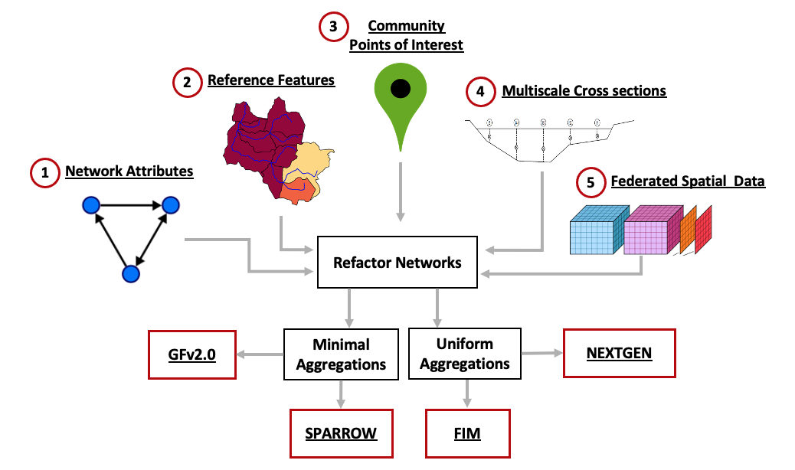
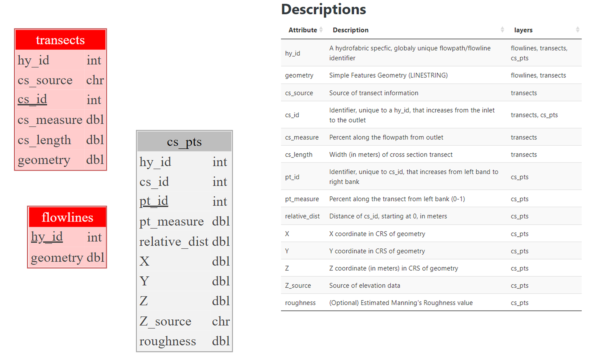
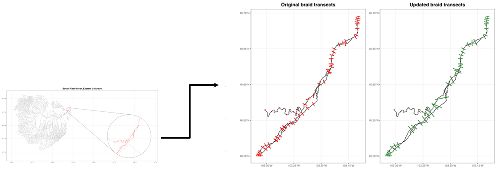
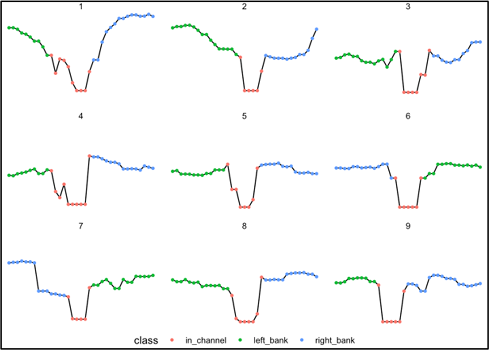
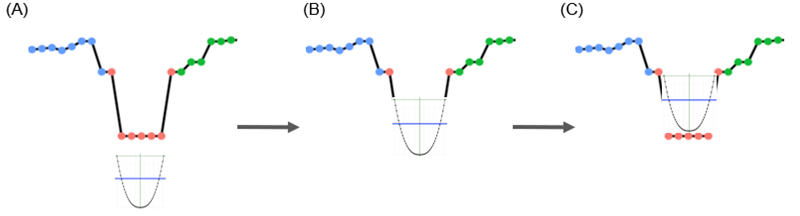
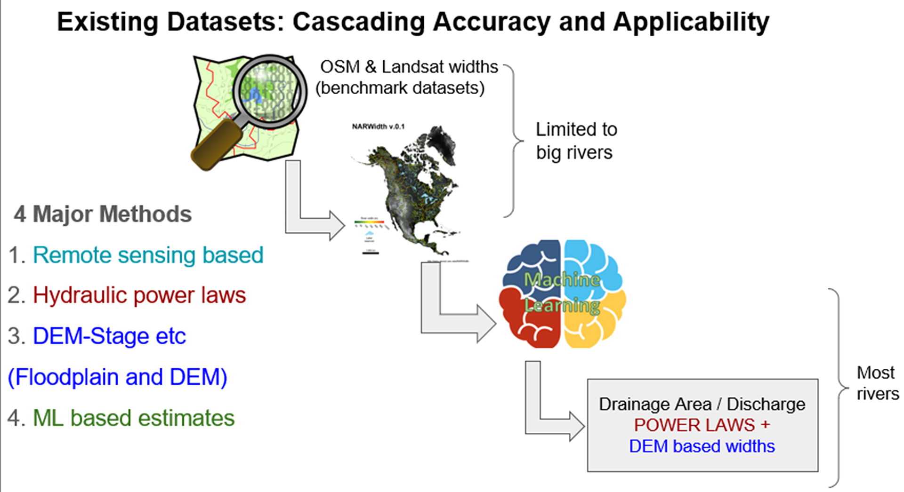
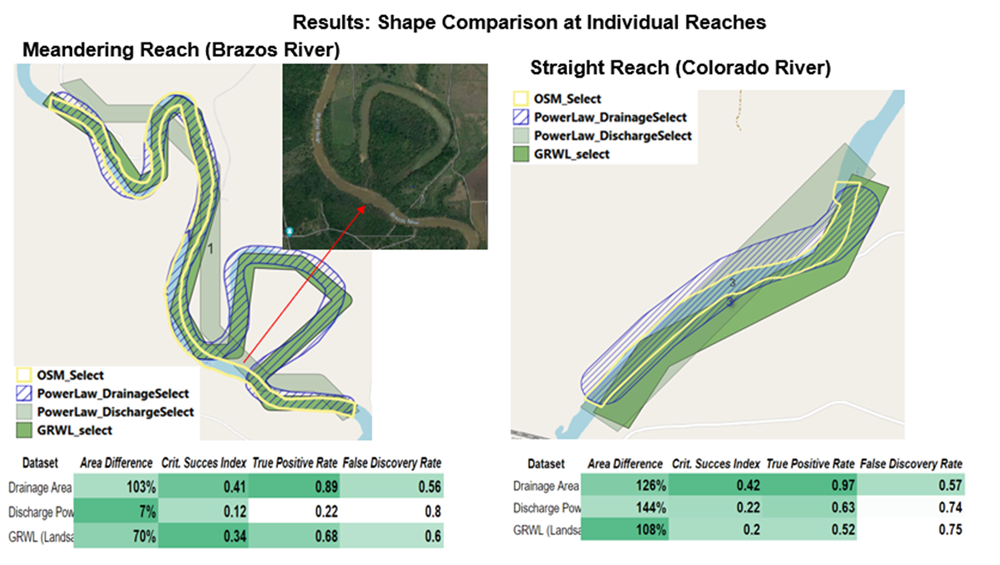

# 3D channel geometry

- [Repo](#Repository)
  * [Cloning](#Cloning)
- [Overview](#Overview)
- [Data Model](#Data-Model)
- [Cross Sections](#Cross-Section )
- [ML Approach for Missing Area](#ML-channel-width,-depth,-and-shape)
- [Satellite based bankfull width](#Satellite-based-bankfull-width)
- [Getting involved](#Getting-involved)
- [Open source licensing info](#Open-source-licensing-info)


## Repository

This repository contains description of the 3D hydrofabric data model and links to all packages, data, and technical details of the development of a 3D channel geometry for CONUS.
  
### Cloning

```shell
git clone https://github.com/NOAA-OWP/3d-hydrofabric.git 
```
## Overview

This project develops a high resolution river channel/corridor data product based of [Reference Hydrofabric](https://noaa-owp.github.io/hydrofabric/articles/02-design-deep-dive.html) that support the modeling needs of NOAA and USGS. It is comprised of multiple modules that together form a clear picture of 3D hydrofabric data model. This includes:

* Development of an automated tools to generate cross sections from a DEM
* Develop machine learning algorithms to predict river channel depth, width, and shape using ground observation 3.
* Estimate channel width using multi-source data and methods (e.g., remote sensing)

Schematic representation of the data model structure and how it is integrated into different products is shown bellow.



One of the challenges of this work is mapping river bathymetries where there is no observation/measurement. The missing topobathy data is the in-channel part of a river system that a Digital Elevation Model (DEM) is not able to penetrate and sees the area as a flat surface. This missing topobathy data results in a misrepresentation of river volume. A representation of channel **depth (D), width (W), and shape** will allow better characterization of flow dynamics and help improve hydrodynamic models, routing models, and synthetic rating curves.

**These three characteristics are obtained from satellite imagery, other data products, and machine learning models and describe in channel geometry that substitutes locations where there is no bathymetry measurement. The new channel shapes that has an estimate of missing channel area will improve modeling capabilities compared to having no bathymetry data**

Finally, all these data are provided through an R package that cuts cross-sections along rivers using 10m DEM and is informed with satellite, other products, and machine learning estimates of channel geometry.


## Data Model

The structure of the data model is based on the reference Hydrofabric Data Model and 

* Has the ability to represent a cross section transect and elevation
* Index knows and synthetic cross sections to a reference network
* Can be supplemented by HEC RAS, eHydro, Lidar



visit this [website](https://noaa-owp.github.io/hydrofabric/articles/cs_dm.html) for more updates.

## Cross Section 

The cross-section tool purpose is to generate DEM-based cross-sections (flood plains) for hydrographic networks and contains the estimates of bankfull channel cross section geometry and wherever there is HEC-RAS or Lidar data it incorporates them as well. 

An example of how these cross-sections look is shown below and a full description is available at [terrain_sliceR](https://github.com/mikejohnson51/terrain_sliceR)

<div style="display: flex; justify-content: center;">
  
</div>

OWP requires cross sections across the complete CONUS network to support hydrologic modeling and requisite flood mapping. We have automated this process and dealt with issues such as braided systems.



Then we define and classify the cross section into left, right banks and in-channel as shown below. The problem is the flat line on the bottom of these plots, which represents the water level when this data was collected and nothing about the conditions at the time of collection (flood, dry year, etc.)

<div style="display: flex; justify-content: center;">
  
</div>

More details about the proposed data model that follows Hyfeatures referencing and how tabular and spatial data are represented can be found [here](https://noaa-owp.github.io/hydrofabric/articles/cs_dm.html)

## ML channel width, depth, and shape 

The goal of this machine learning model is to learn channel shape, width, and depth using at a feature hydraulic geometry relations ([see here](https://noaa-owp.github.io/hydrofabric/articles/07-channel-geometry.html)). Here we use the concept of paramterizing channel proposed by [Dingman (2007)](https://www.sciencedirect.com/science/article/pii/S0022169406005063?casa_token=gKpjjfHrupEAAAAA:Cp1tVhLnwlfddS38gpcKiyOm_xR09JeTgEtYZbCP-c8SUSth6Fx6gBPOWeyxZldCClEL20EJ2JI) to get an estimate of channel shape.

The inputs to the model are carefully chosen from investigating a wide litrature on this topic including works by [Lin et al., 2020](https://agupubs.onlinelibrary.wiley.com/doi/full/10.1029/2019GL086405), [Blackburn-Lynch et al., 2017](https://onlinelibrary.wiley.com/doi/full/10.1111/1752-1688.12540?casa_token=UgvAE7gtRPsAAAAA%3Anb2Kq8WP8d_TAD8lu7CE1CkpaY7386FzBPvym436EOqP3gc7pGKRcxE_Tt1XQEtRYEAngTHmLa1iDxo), [Doyle et al., 2023](https://onlinelibrary.wiley.com/doi/full/10.1111/1752-1688.13116?casa_token=mGKCMw89-DoAAAAA%3AF3lJezzo74bXEB-8uo04pBYyth6ny9pi_R_u9Ubb48cI7sMO9erOisD_g8dQsjd-r-LHJEO-e0hT_EA).

These data include:
1. Climate variables
2. Soil and sub-surface characteristics
3. Catchment characteristics
4. Topology and flow characteristics
5. National Water Model flood frequencies
6. Anthropogenic Influences

These data are aggregated from various databases including, the reference fabric, StreamCat, NWM 2.1, different satellite, reanalysis, and LSM models.

The [HYDRoSWOT](https://data.usgs.gov/datacatalog/data/USGS:57435ae5e4b07e28b660af55) – HYDRoacoustic dataset in support of Surface Water Oceanographic Topography is used as ground truth data for our ML models. A rigorous fitting and data cleaning procedure is applied using the [AHGestimation](https://mikejohnson51.github.io/AHGestimation/) package ([Johnson et al, 2023](https://www.preprints.org/manuscript/202212.0390/v1)).  

Given a set of characteristics described above the ML model predicts all 6 coefficients and exponents of the hydraulic geometry relations for bankfull width, depth, and velocity. It also predicts the channel shape parameter (Dinman's r)
that gives a schematic representation of the channel shape.

<div style="display: flex; justify-content: center;">
  
</div>

The trained ML model then can be used to predict channel shape for all valid locations in HydroSWOT database.


and predictions of Bankfull width and depth surpass the currently implemented regional estimates in NWM 2, 2.1, and 3 for different hydrological landscape regions.


For comprehensive details please visit this [site](https://sites.google.com/u.boisestate.edu/conus-fhg/home?pli=1#h.p04mdv3fynoe) for more details.

Ultimately, the ML based channel geometry for bankfull conditions are used to burn in the missing bathymetry.



## Satellite based bankfull width

For larger river systems, we use different remote sensing and post-process products such as [Global River Widths from Landsat (GRWL)](https://zenodo.org/record/1297434), [MERIT Hydro](http://hydro.iis.u-tokyo.ac.jp/~yamadai/MERIT_Hydro/), and etc. that are outlined below:



> North American River Width Data Set (NARWidth) [link](http://gaia.geosci.unc.edu/NARWidth/#:~:text=NARWidth%20is%20composed%20of%20planform,Landsat%20TM%20and%20ETM%2B%20imagery.)

> Global River Widths from Landsat (GRWL) [link](https://zenodo.org/records/1297434)

> Global Long-term River Width (GLOW) [link](https://zenodo.org/records/6425657)

> Openstreetmap river polygons [link](https://www.geofabrik.de/data/download.html)

> Global river bankfull width and depth database [link](https://zenodo.org/records/61758)

> CONUS Bankfull Hydraulic Geometry [link](https://www.sciencebase.gov/catalog/item/5cf02bdae4b0b51330e22b85)

> Global Surface Water Explorer (GSW) [link](https://global-surface-water.appspot.com/download)

> MERIT hydro [link](http://hydro.iis.u-tokyo.ac.jp/~yamadai/MERIT_Hydro/)

> U.S. Forest Service national riparian areas [link](https://www.fs.usda.gov/rds/archive/catalog/RDS-2019-0030)

> SWOT River Database (SWORD) [link](https://zenodo.org/records/10013982)

> Global bankfull river widths (GBRW) [link](https://zenodo.org/records/3552776)

We compare each dataset and use OSM as river benchmark and 

* We perform Vector operations/spatial queries to link data

* Width Attributes from other datasets added to reference hydrofabric dataset 



## Getting involved

NOAA's National Water Center welcomes anyone to contribute to the 3D Hydrofabric repository to enhance OWP's FIM and NextGen capabilities. Please contact Alemayehu Midekisa (alemayehu.midekisa@noaa.gov) or Fernando Salas (fernando.salas@noaa.gov) to get started.

----

## Open source licensing info
1. [TERMS](TERMS.md)
2. [LICENSE](LICENSE)


----

## Open source licensing info


----

